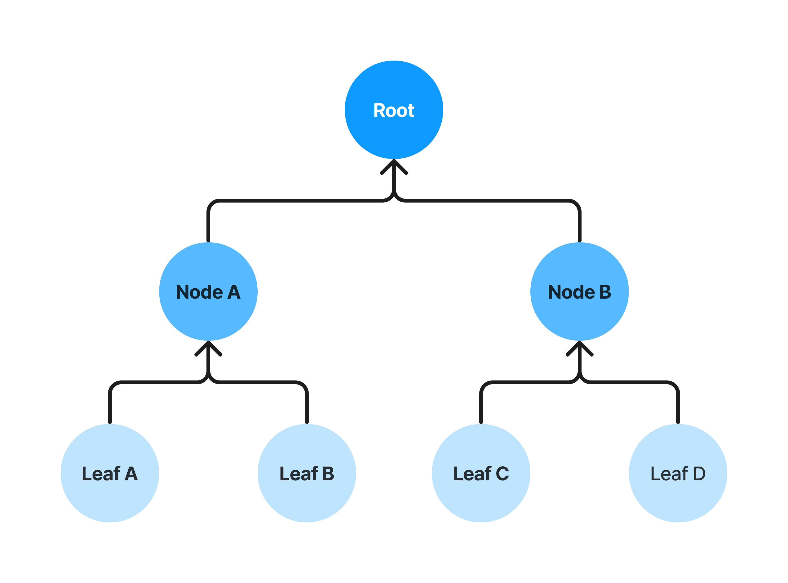

# 🌳 Merkly

The **simple and easy** implementation of **Python Merkle Tree**

---

[](https://github.com/olivmath/merkly/actions/workflows/codeql-analysis.yml)
[](https://github.com/olivmath/merkly/actions/workflows/lint.yml)
[](https://github.com/olivmath/merkly/actions/workflows/test.yml)
[](https://pypi.org/project/merkly/)


[](https://pypi.org/project/merkly/)
[](https://pypi.org/project/merkly/)


## Table of Contents

- [Credits](#credits)
- [How to install](#how-to-install)
- [How to works](#how-to-works)
- [How to use](#how-to-use)
- [Contributing](#contributing)
- [License](#license)

## Credits

[](https://github.com/olivmath/merkly/graphs/contributors)

## How to install

```
poetry add merkly
```

```
pip install merkly
```

## How it works

This library provides a clean and easy to use implementation of the Merkle Tree with the following features:

- [x] Create Leaf
- [x] Create Root
- [x] Create Proof
- [ ] Validate Leafs



## How to Use

Create a Merkle Tree

```python
from merkly.mtree import MerkleTree

mtree = MerkleTree(
  ['a', 'b', 'c', 'd']
)

assert mtree.leafs == [
  '3ac225168df54212a25c1c01fd35bebfea408fdac2e31ddd6f80a4bbf9a5f1cb',
  'b5553de315e0edf504d9150af82dafa5c4667fa618ed0a6f19c69b41166c5510',
  '0b42b6393c1f53060fe3ddbfcd7aadcca894465a5a438f69c87d790b2299b9b2',
  'f1918e8562236eb17adc8502332f4c9c82bc14e19bfc0aa10ab674ff75b3d2f3'
]

assert mtree.root == [
  '115cbb4775ed495f3d954dfa47164359a97762b40059d9502895def16eed609c'
]
```

## Contributing

- Before read a code of conduct: **[CODE_OF_CONDUCT](CODE_OF_CONDUCT.md)**
- Follow the guide of development: **[CONTRIBUTING](CONTRIBUTING.md)**

## License

[MIT](LICENSE)
