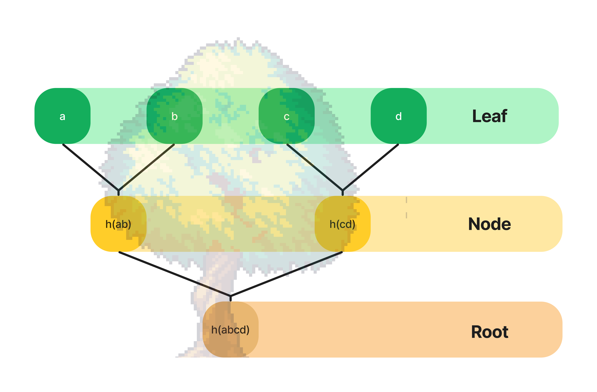

# 🌳 Merkly

The **simple and easy** implementation of **Python Merkle Tree**

---
[](https://github.com/olivmath/merkly/actions/workflows/codeql-analysis.yml)
[](https://github.com/olivmath/merkly/actions/workflows/test.yml)


[](https://pypi.org/project/merkly/)
[](https://pypi.org/project/merkly/)
[](https://pypi.org/project/merkly/)


## Table of Contents

- [Credits](#credits)
- [How to install](#how-to-install)
- [How to works](#how-to-works)
- [How to use](#how-to-use)
- [Contributing](#contributing)
- [License](#license)

## Credits

[](https://github.com/olivmath/merkly/graphs/contributors)

## How to install

```
poetry add merkly
```

```
pip install merkly
```

## How it works

This library provides a clean and easy to use implementation of the Merkle Tree with the following features:

- [x] Create Leaf
- [x] Create Root
- [ ] Create Proof
- [ ] Validate Leafs

<!--  -->


## How to Use

Create a Merkle Tree

```python
from merkly.mtree import MerkleTree

mtree = MerkleTree(
  ['a', 'b', 'c', 'd']
)

assert mtree.leafs == [
  '3ac225168df54212a25c1c01fd35bebfea408fdac2e31ddd6f80a4bbf9a5f1cb',
  'b5553de315e0edf504d9150af82dafa5c4667fa618ed0a6f19c69b41166c5510',
  '0b42b6393c1f53060fe3ddbfcd7aadcca894465a5a438f69c87d790b2299b9b2',
  'f1918e8562236eb17adc8502332f4c9c82bc14e19bfc0aa10ab674ff75b3d2f3'
]

assert mtree.root == [
  '115cbb4775ed495f3d954dfa47164359a97762b40059d9502895def16eed609c'
]
```

## Contributing

- Before read a code of conduct: **[CODE_OF_CONDUCT](CODE_OF_CONDUCT.md)**
- Follow the guide of development: **[CONTRIBUTING](CONTRIBUTING.md)**

## License

[MIT](LICENSE)


Are you a builder or a consumer?

This is my small contribution to the web3 + python community, a simple and easy to use implementation of Merkle Tree in python3.
I am preparing a sample of how a Merkle Tree can be useful in the process of airdropping a token using a whitelist.

Leave a star!

------
Vc é um construtor ou consumidor?

Essa é minha pequena contribuição à comunidade web3 + python, uma implementação simples e fácil de usar da Merkle Tree em python3.
Estou preparando uma amostra de como uma Merkle Tree pode ser útil no processo de airdrop de um token usando uma whitelist.

Deixa uma estrelinha!